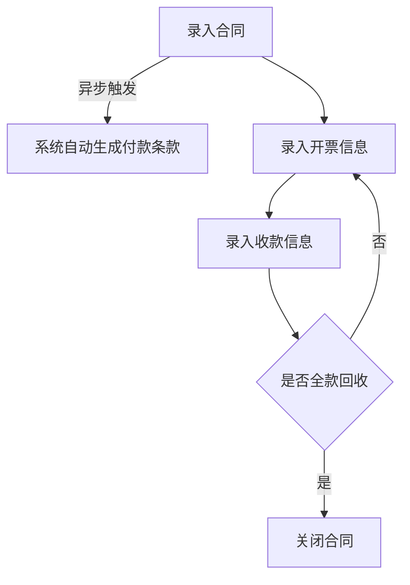
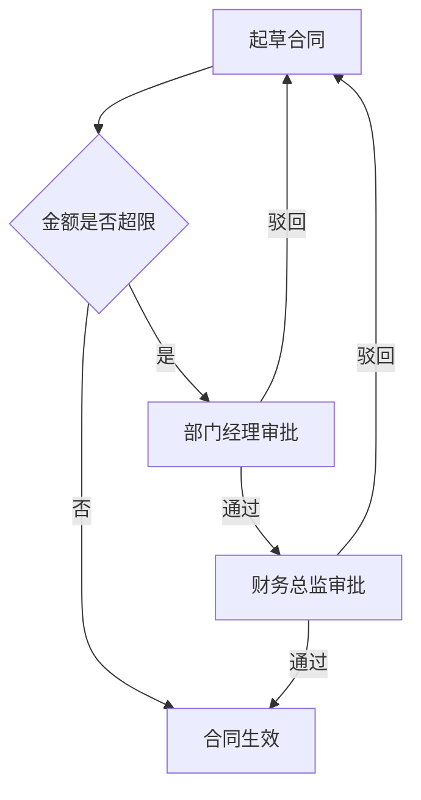

# 软件需求文档编写规范

> 面向本体建模的软件需求文档标准 · 用于将原始业务需求转化为可直接驱动 M1–M5 本体建模的完整需求文档
> 版本 1.0

---

## 一、规范定位与边界

### 1.1 核心目标

本规范定义了一份"完整"的软件需求文档应当包含的内容结构，其完整性的唯一判定标准是：**该需求文档是否足以支撑 AI 在不做任何主观假设的前提下，完成 M1（对象模型）、M2（行为模型）、M3（规则模型）、M4（场景模型）、M5（主体模型）五个本体模型的高质量建模**。

不是"写得详细"就算完整，而是"七个本体模型需要的每一类信息，都能在需求文档中找到明确来源"才算完整。

### 1.2 本规范不覆盖的范围

以下内容明确不在本规范要求的需求文档范围内，留待后续技术架构设计阶段处理：

- **UI/UE 界面与交互设计**：不描述页面布局、控件样式、点击路径、表单交互细节
- **M6 技术异常补偿模型**：事务回滚、重试、幂等、故障补偿和基础设施恢复——本期不要求；但撤回、驳回、取消、作废、暂停/恢复、更正、重开等业务逆流程与业务异常仍必须在本需求文档中适度说明
- **M7 质量约束模型**：性能指标、并发策略、审计要求——本期不要求
- **外部系统集成契约**：第三方接口协议、认证方式、超时重试——本期不要求

业务功能的描述始终停留在**业务动作层**，例如"录入合同基本信息"，而不下沉到**交互层**，例如"在表单中输入合同编号字段"。这条边界必须在需求撰写和评审中始终遵守，否则会导致文档风格不一致，也会让后续 UI 设计阶段失去自由度。

### 1.3 文档结构总览

完整的软件需求文档包含六个部分，对应关系如下：

| 部分 | 名称 | 主要对应本体模型 |
|------|------|------------------|
| 第一部分 | 场景与流程说明 | M4 场景模型 |
| 第二部分 | 业务功能说明（含规则） | M2 行为模型 + M3 规则模型 |
| 第三部分 | 业务对象说明 | M1 对象模型 |
| 第四部分 | 岗位角色说明 | M5 主体模型 |
| 附录 A | 术语表 | 全局引用 |
| 附录 B | 待澄清问题清单 | 全局引用 |

四个部分之间存在严格的交叉引用关系：场景引用业务功能，业务功能引用业务对象和岗位角色，业务对象之间存在关联引用。文档撰写时必须使用统一的编号体系，保证可以相互引用、互相校验。

---

## 二、编号体系规范

为保证文档各部分之间可以精确交叉引用，所有要素必须按以下规则编号：

| 要素类型 | 编号格式 | 示例 |
|---------|---------|------|
| 业务对象 | OBJ-{业务域缩写}-{三位序号} | OBJ-CON-001（合同） |
| 业务功能 | FUNC-{业务域缩写}-{三位序号} | FUNC-CON-001（录入合同） |
| 业务规则 | RULE-{业务域缩写}-{三位序号} | RULE-CON-001（合同金额校验） |
| 端到端流程 | PROC-{业务域缩写}-{三位序号} | PROC-CON-001（合同履约回款流程） |
| 审批流 | APPR-{业务域缩写}-{三位序号} | APPR-CON-001（合同审批流） |
| 岗位角色 | ROLE-{角色缩写} | ROLE-SALES（销售人员） |

业务域缩写在文档开篇统一定义（如 CON=合同、INV=开票、PMT=付款条款），全文档保持一致，不允许同一业务域出现多个缩写。

---

## 三、第一部分：场景与流程说明

### 3.1 本部分要回答的核心问题

- 这个业务领域端到端的完整流程是什么样的？
- 流程中哪些单据需要人工审批？审批流是怎样的？
- 流程步骤之间，哪些是"做完立刻继续下一步"，哪些是"做完之后允许稍后处理、不阻塞主流程"？
- 核心流程是否存在撤回、驳回、取消、作废、暂停/恢复、更正、重开或业务规则失败等逆向/异常分支？这些分支由谁处理，处理后状态和关联影响是什么？

### 3.2 端到端流程说明（每个 PROC 一份）

每个端到端业务流程必须包含以下字段：

```markdown
### PROC-CON-001 合同履约回款流程

**流程目标**：描述这个流程整体要达成的业务结果（一句话）

**流程参与角色**：列出流程中涉及的所有岗位角色（引用 ROLE 编号）

**流程步骤**（按顺序列出，每一步标注步骤类型）：

| 步骤 | 步骤描述 | 引用的业务功能 | 衔接类型 | 分支条件 |
|------|---------|----------------|---------|---------|
| 1 | 录入合同 | FUNC-CON-001 | 同步等待 | - |
| 2 | 系统自动生成付款条款 | FUNC-PMT-001 | 异步触发 | - |
| 3 | 录入开票信息（可重复执行） | FUNC-INV-001 | 同步等待 | - |
| 4 | 录入收款信息 | FUNC-INV-002 | 同步等待 | - |
| 5 | 判断是否全款回收 | - | 条件分支 | 是→步骤6；否→返回步骤3 |
| 6 | 关闭合同 | FUNC-CON-002 | 同步等待 | - |

**Mermaid 流程图**：


```

**逆向与业务异常分支**（核心状态变更流程必填；不适用时明确写 `不适用`）：

| 分支 | 触发条件 | 操作角色 | 允许前置状态 | 处理动作 | 处理后状态 | 关联对象/下游/指标影响 | 审批、留痕与验收结果 |
|------|---------|---------|-------------|---------|-----------|------------------------|----------------------|
| 撤回合同 | 合同已提交但尚未完成审批 | ROLE-SALES | 待审批 | 撤回并退回修改 | 草稿 | 停止后续审批，不计入生效合同指标 | 记录撤回人和时间；验收为合同可重新编辑 |
| 作废合同 | 合同已生效但确认不再履行 | ROLE-CON-ADMIN | 生效 | 作废合同 | 已作废 | 关联财务凭证保留，未执行任务停止，统计口径按已确认规则处理 | 是否审批待确认；记录原因 |

如逆向动作本身是可复用、可授权、可独立验收的业务动作，应定义独立的 `FUNC` 并在本表引用；简单字段校验失败保留在 `RULE` 中即可。不要为了形式完整给查询类功能机械增加逆流程。

**"衔接类型"字段是强制必填项**，每一个步骤到下一步骤的衔接，必须从以下两个值中明确选择一个：

- **同步等待**：当前步骤的执行结果是下一步骤的直接输入，下一步骤必须等待当前步骤完成才能开始，当前步骤失败则整个流程在此中断
- **异步触发**：当前步骤完成后产生一个业务事件，下一步骤是对该事件的响应，允许延迟执行，下一步骤的失败原则上不影响当前步骤已经达成的结果

这个字段直接决定后续 ME 事件模型是否需要为该衔接点建立独立的事件定义，是流程描述中信息密度最高、也最容易被自然语言描述模糊掉的字段，撰写和评审时必须重点检查。

### 3.3 审批流说明（每个 APPR 一份，如适用）

**关键确认要求**：对于流程中涉及的每一个核心业务单据（如合同、开票单、付款申请），必须明确回答"这个单据是否需要人工审批"，不允许默认假设有或没有。如果存在审批流，按以下结构说明：

```markdown
### APPR-CON-001 合同审批流

**适用单据**：OBJ-CON-001 合同

**触发条件**：什么情况下需要走审批（如：合同金额超过 X 万元）

**审批节点**：

| 节点序号 | 审批角色 | 审批动作 | 通过后状态 | 驳回后状态 |
|---------|---------|---------|-----------|-----------|
| 1 | 部门经理 | 一级审批 | 进入二级审批 | 退回起草人修改 |
| 2 | 财务总监 | 二级审批 | 合同生效 | 退回起草人修改 |

**Mermaid 流程图**：


```

如果该单据明确不需要审批，仍需在文档中显式记录"OBJ-CON-001 合同：无需审批，录入后直接生效"，不允许留空——留空会被视为信息缺失而非"无审批"的确认结果。

### 3.4 流程图输出要求

本规范中所有流程图，无论是端到端流程、审批流，还是后续业务功能中的分支逻辑示意，**一律使用 Mermaid 源代码格式输出**，不使用图片、不使用其他绘图工具的专有格式。常用图表类型：

- 顺序流程、分支判断：`flowchart TD`
- 审批流转：`flowchart TD` 配合菱形判断节点
- 跨角色协作时序：`sequenceDiagram`（可选，用于强调角色间交互顺序时使用）

对会改变流程走向、状态或下游结果的重要逆向/异常分支，应纳入端到端流程图或单独的业务异常流程图；字段缺失、格式错误等简单校验异常无需逐项画图，在业务规则中描述即可。

---

## 四、第二部分：业务功能说明

### 4.1 本部分要回答的核心问题

- 这个业务功能由谁来操作？操作什么业务对象？
- 操作前需要满足什么条件？操作完成后业务对象自身变成了什么状态？
- 操作完成后是否会自动触发别的事情？
- 这个功能涉及哪些独立的业务规则？
- 这个功能是否允许撤回、取消、作废、更正、重开等逆向操作，或存在需要业务人员处理的异常？

### 4.2 业务功能说明结构（每个 FUNC 一份）

```markdown
### FUNC-CON-001 录入合同

**操作角色**：ROLE-SALES 销售人员、ROLE-CON-ADMIN 合同管理员

**主操作对象**：OBJ-CON-001 合同

**引用的关联对象**：OBJ-PRD-001 产品、OBJ-CUS-001 客户、OBJ-DEPT-001 部门

**前置条件**：
- 合同编号在系统中不存在（唯一性）
- 引用的产品、客户、部门均处于有效状态
- 当前用户具备合同录入权限

**操作步骤说明**（业务动作层，不涉及UI交互）：
1. 录入合同基本信息（合同编号、合同名称、所属产品、所属客户、所属部门、责任人）
2. 录入合同金额信息（合同总金额、税率）
3. 录入付款条款明细（至少一条，每条包含阶段名称、付款比例）
4. 提交保存

**涉及的业务规则**：
- RULE-CON-001 合同金额合规校验
- RULE-CON-002 税率合规校验
- RULE-PMT-001 付款比例总和校验

**后置状态变更**：
- 合同状态变更为"生效"

**下游触发**：
- 自动触发 FUNC-PMT-001（批量创建付款条款），衔接类型：异步触发（见 PROC-CON-001 步骤2）

**逆向操作与业务异常**：
- 撤回：待审批状态允许 ROLE-SALES 撤回，状态恢复为“草稿”，停止后续审批并记录撤回人、时间
- 作废：生效状态是否允许作废、由谁操作、对子对象和指标的影响，标记为 `[待确认]`
- 金额或税率校验失败：拒绝提交，合同保持“草稿”，按 RULE-CON-001、RULE-CON-002 返回业务校验结果
```

### 4.3 字段填写强制要求

以下字段为本部分的强制必填项，不允许省略：

| 字段 | 缺失时的风险 |
|------|------------|
| 操作角色 | 无法建立 M5 权限关联，无法生成权限校验逻辑 |
| 主操作对象 | 无法确定 M2 行为的原子性锚点 |
| 前置条件 | 行为执行的校验逻辑缺失依据 |
| 操作步骤说明 | 行为的业务含义不明确 |
| 涉及的业务规则 | 无法分离独立的 M3 规则节点，规则散落在描述文字中无法复用 |
| **后置状态变更** | 业务对象自身的生命周期状态变化缺失，影响状态机校验逻辑生成 |
| 下游触发 | 无法判断是否需要建立 ME 事件模型 |
| **逆向操作与业务异常** | 无法判断业务是否可撤回、驳回、取消、作废、暂停/恢复、更正或重开，也无法评估关联对象、下游流程和统计指标影响；不适用时需显式说明 |

**后置状态变更**与**下游触发**是两个完全不同的概念，必须分别填写：后置状态变更回答"这个对象自己变成了什么样子"，下游触发回答"除了这个对象自己的变化之外，还引发了什么别的事情"。两者经常被需求撰写者混为一谈，必须在评审时重点检查是否分别清楚填写。

对改变业务状态或下游结果的功能，**逆向操作与业务异常**还必须说明：触发条件、操作角色、允许前置状态、处理后状态、关联对象/下游/指标影响、审批或留痕要求及验收结果。无适用分支时填写 `不适用`。本字段只描述业务处理，不展开事务回滚、重试、幂等或基础设施补偿。

### 4.4 业务规则独立定义结构（每个 RULE 一份）

任何一条在业务功能说明中被引用的业务规则，必须在文档中有独立的定义条目，不允许只在业务功能描述的文字段落中一笔带过：

```markdown
### RULE-CON-002 税率合规校验

**规则类型**：校验类（输入数据是否合法）

**规则描述**：合同税率必须在 0 到 1 之间的小数（如 0.13 代表 13%）

**业务异常处理**：校验失败时拒绝提交，合同保持原状态，并返回可供业务人员修正的校验结果

**校验失败提示**：税率须在0到1之间

**被哪些业务功能引用**：FUNC-CON-001 录入合同、FUNC-INV-001 录入开票
```

规则类型按以下四类划分，撰写时需明确归属，便于后续与 M3 规则模型的五种类型对齐：

- **校验类**：判断单次输入是否合法（如金额必须大于0）
- **计算类**：根据输入计算出某个结果值（如运费计算）
- **推导类**：基于已知信息推导出新的属性或结论（如根据角色推导数据可见范围）
- **转换类**：将一种数据格式转换为另一种（通常出现在外部系统对接场景，本期较少涉及）

**规则复用强制检查**：如果同一条业务规则在两个或以上业务功能中都被提及（即使描述文字略有差异），必须识别为同一条规则、合并为一个 RULE 编号，在"被哪些业务功能引用"字段中列出全部引用方，不允许同一逻辑重复定义为多条规则。

---

## 五、第三部分：业务对象说明

### 5.1 本部分要回答的核心问题

- 业务需求中涉及哪些业务对象？哪些是单据类对象，哪些是主数据对象，哪些是枚举类对象？
- 每个对象有哪些业务属性？属性的类型、长度、约束是什么？
- 对象之间存在什么样的引用关系？这种引用是强依赖还是弱关联？
- 一个对象被删除或作废时，与它关联的其他对象应该如何处理？

### 5.2 业务对象分类

撰写前需先对涉及的全部业务对象做分类标注：

| 分类 | 说明 | 示例 |
|------|------|------|
| 单据类对象 | 有完整生命周期状态流转的业务单据 | 合同、开票单、付款申请 |
| 聚合子对象 | 依附于某个单据类对象、不能独立存在的明细信息 | 合同付款条款、订单明细 |
| 主数据对象 | 相对稳定、被多个单据引用的基础数据 | 客户、产品、供应商、部门、人员 |
| 枚举类对象 | 取值范围固定的分类标识 | 订单类型、合同状态 |

### 5.3 业务对象说明结构（每个 OBJ 一份）

```markdown
### OBJ-CON-001 合同

**对象分类**：单据类对象

**对象说明**：企业与客户签订的销售合同，是合同管理的核心单据

**生命周期状态**：草稿 → 生效 → 已关闭

**业务属性**：

| 属性名 | 中文名 | 类型 | 长度/精度 | 是否必填 | 是否唯一 | 引用对象 |
|--------|--------|------|----------|---------|---------|---------|
| contractId | 合同编号 | 字符串 | 50 | 是 | 是 | - |
| contractName | 合同名称 | 字符串 | 200 | 是 | 否 | - |
| productId | 所属产品 | 字符串 | 50 | 是 | 否 | OBJ-PRD-001 |
| customerId | 所属客户 | 字符串 | 50 | 是 | 否 | OBJ-CUS-001 |
| departmentId | 所属部门 | 字符串 | 50 | 是 | 否 | OBJ-DEPT-001 |
| responsibleEmployeeId | 责任人 | 字符串 | 50 | 是 | 否 | OBJ-EMP-001 |
| totalAmount | 合同总金额 | 数值 | (18,2) | 是 | 否 | - |
| taxRate | 税率 | 数值 | (5,4) | 是 | 否 | - |
| status | 合同状态 | 枚举 | - | 是 | 否 | OBJ-ENUM-CON-STATUS |

**关联的聚合子对象**：

| 子对象 | 关联说明 | 父对象作废/删除时子对象如何处理 |
|--------|---------|----------------------------------|
| OBJ-PMT-001 付款条款 | 一份合同包含多条付款条款 | 合同删除则付款条款级联删除（组合关系） |

**关联的其他业务对象**：

| 关联对象 | 关联关系说明 | 父对象作废/删除时如何处理 |
|---------|-------------|---------------------------|
| OBJ-INV-001 开票明细 | 一份合同对应多张开票 | 合同删除后开票记录作为财务凭证独立保留（聚合关系，不级联删除） |

**参照完整性约束**：
- 合同总金额必须大于 0
- 税率必须在 0 到 1 之间
```

### 5.4 关联关系强制确认要求

**这是本部分撰写中最容易遗漏、也是后续影响最大的一项**：对于任何一对存在父子或引用关系的业务对象，必须明确回答"父对象删除或作废时，子对象/关联对象应该如何处理"，且答案只能是以下两种之一：

- **级联处理**（对应组合关系）：父对象删除时，子对象一并删除，子对象不能脱离父对象独立存在
- **独立保留**（对应聚合关系）：父对象删除或作废时，已存在的关联对象不受影响，继续独立存在

这个问题不能依赖 AI 从业务对象的名称或描述里自行推断，必须由业务专家明确确认并记录在文档中，因为同样名称的对象在不同企业的业务场景下答案可能完全相反（例如"开票记录是否随合同删除而删除"，不同企业的财务合规要求不同）。

### 5.5 枚举类对象说明结构

```markdown
### OBJ-ENUM-CON-STATUS 合同状态枚举

**对象说明**：合同的生命周期状态取值集合

**取值列表**：

| 取值 | 中文名 | 说明 |
|------|--------|------|
| DRAFT | 草稿 | 已创建但未生效 |
| ACTIVE | 生效 | 正常履约中 |
| CLOSED | 已关闭 | 履约完成或终止 |
```

---

## 六、第四部分：岗位角色说明

### 6.1 本部分要回答的核心问题

- 整个业务涉及哪些岗位角色？
- 每个角色能操作哪些业务功能？
- 每个角色能否执行撤回、作废、更正、重开等敏感逆向操作？
- **对于查询/列表类功能，不同角色能看到的数据范围有什么不同？**（这一点与"能不能操作某个功能"是两个完全不同的问题，必须分别确认）

### 6.2 岗位角色说明结构（每个 ROLE 一份）

```markdown
### ROLE-SALES 销售人员

**角色说明**：负责合同签订和客户维护的一线业务人员

**功能权限**（这个角色能操作哪些业务功能）：

| 业务功能 | 是否可操作 |
|---------|-----------|
| FUNC-CON-001 录入合同 | 是 |
| FUNC-CON-002 关闭合同 | 否 |
| FUNC-CON-003 查询合同列表 | 是 |

**数据范围**（对于可查询/可操作的功能，能看到/能改哪些范围的数据）：

| 业务功能 | 数据范围说明 |
|---------|-------------|
| FUNC-CON-003 查询合同列表 | 仅能查看责任人为自己的合同 |
| FUNC-CON-001 录入合同 | 仅能将自己设为责任人 |
```

### 6.3 数据范围确认的强制要求

**对于文档中出现的每一个查询类、列表类业务功能**，必须在涉及该功能的每一个岗位角色条目下，明确填写数据范围说明，不允许仅依赖"功能权限"表格里的"是/否"作为唯一权限描述。

判断是否需要补充数据范围说明的标准很简单：**只要这个功能涉及到查看一组数据（而不是单条已知ID的数据），就必须明确不同角色之间看到的范围是否相同**。如果某个角色对某功能没有数据范围限制（能看到全部数据），也必须显式写明"无限制，可查看全部数据"，不允许留空。

数据范围的常见类型供撰写时参考（实际范围以业务专家确认为准，不强制限定于以下类型）：

- 仅本人相关的数据
- 仅本部门相关的数据
- 全部数据，无限制
- 其他自定义范围（需明确描述具体规则）

---

## 七、附录 A：术语表

文档正文中出现的业务术语、缩写、行业惯用语，需在此处统一定义中英文对照和准确含义，避免后续建模阶段对同一术语有不同理解。

```markdown
| 术语 | 英文/缩写 | 含义说明 |
|------|----------|---------|
| GMV | Gross Merchandise Volume | 成交总额 |
| 合同履约 | Contract Fulfillment | 合同从生效到完成全部交付和回款的过程 |
```

---

## 八、附录 B：待澄清问题清单

需求撰写过程中，如果遇到业务专家未能立即给出明确答案的问题，不允许搁置不记录，必须统一登记在本清单中，作为需求文档"未完成"状态的显式标记：

```markdown
| 问题编号 | 涉及部分 | 问题描述 | 提出日期 | 状态 | 确认结果 |
|---------|---------|---------|---------|------|---------|
| Q-001 | OBJ-CON-001 | 合同删除时，关联的开票记录是否需要级联删除？ | 2026-03-01 | 待确认 | - |
```

只要本清单中存在状态为"待确认"的条目，该需求文档即视为**未完成状态**，不能进入本体建模阶段。

---

## 九、需求完整性自检清单

撰写完成后，使用以下清单逐项自检，全部通过方可视为需求文档完整：

**场景与流程（对应 M4）**
- [ ] 是否有完整的端到端流程说明，且每个流程都有 Mermaid 流程图
- [ ] 是否对文档中出现的每一个核心单据，都明确回答了"是否需要审批"（包括明确回答"不需要"的情况）
- [ ] 是否每个审批流都有完整的审批节点、通过/驳回后的状态流转说明，且有 Mermaid 流程图
- [ ] 流程步骤之间的衔接，是否每一处都明确标注了"同步等待"或"异步触发"
- [ ] 每个核心流程是否识别了适用的业务逆向/异常分支，或明确记录 `不适用`
- [ ] 会改变状态、下游或指标的重要逆向/异常分支是否已进入 Mermaid，简单校验异常是否已进入业务规则

**业务功能（对应 M2、M3）**
- [ ] 每个业务功能是否都明确了操作角色、主操作对象、引用对象
- [ ] 每个业务功能是否都说明了前置条件
- [ ] 每个业务功能是否都明确区分了"后置状态变更"和"下游触发"两个独立字段
- [ ] 每个改变状态的业务功能是否说明了适用的撤回、驳回、取消、作废、暂停/恢复、更正、重开及业务异常处理，或明确记录 `不适用`
- [ ] 逆向/异常处理是否明确了操作角色、允许前置状态、处理后状态、关联对象/下游/指标影响、审批或留痕要求及验收结果
- [ ] 每个业务功能引用的业务规则，是否都有独立的 RULE 条目定义，而非仅在文字中提及
- [ ] 同一条业务规则被多个功能引用时，是否已合并为同一个 RULE 编号

**业务对象（对应 M1）**
- [ ] 是否对所有业务对象做了单据类/聚合子对象/主数据/枚举类的分类
- [ ] 每个对象的业务属性是否都说明了类型、长度、是否必填、是否唯一、引用对象
- [ ] 每一对存在父子或引用关系的对象，是否都明确回答了"父对象删除/作废时子对象如何处理"（级联处理或独立保留二选一，不允许遗漏）

**岗位角色（对应 M5）**
- [ ] 是否列出了业务涉及的全部岗位角色
- [ ] 每个角色的功能权限是否完整列出
- [ ] 撤回、作废、更正、重开等敏感逆向操作是否明确了可执行或审批角色
- [ ] **对每一个查询/列表类功能，是否在每个相关角色下都明确填写了数据范围说明**（无限制也需显式写明）

**全局**
- [ ] 附录 B 待澄清问题清单中是否不存在"待确认"状态的条目
- [ ] 文档中是否未出现任何 UI/UE 交互层面的描述（页面布局、控件、点击路径等）

---

*文档版本 v1.0 | 软件需求文档编写规范 | 2026年3月*
